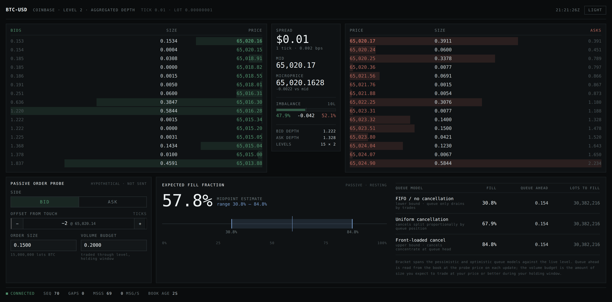

# orderbook-live

A live limit-order-book viewer that reconstructs the top of a crypto market
from Coinbase's public depth stream, and lets you probe it with a passive
order to see how the queue-position models I built in
[orderbook-sim](https://github.com/finntech3/orderbook-sim) actually behave
against real depth.

The interesting question this project answers is not "what price is BTC at?"
Any exchange page shows that. It is: *if I placed a passive order 3 ticks
below the touch right now, what fraction of it would probably fill in the
next 30 seconds?* That number depends on assumptions about where in the
queue the cancellations you observe were sitting — and those assumptions
disagree. Showing the disagreement, live, was the point of the whole
exercise.

**Live viewer:** https://finntech3.github.io/orderbook-live/



The hero panel is the point of the whole thing: place a hypothetical
passive order and the three queue models disagree about how much of it
fills — here, anywhere from 31% to 85%. The honest answer is the range,
not a single number. The screenshot is the real UI rendering real
Coinbase depth (captured mid-stream); a light theme ships too.

## What's here

- A depth-book engine that maintains a live picture of a Coinbase market
  from the batched level-2 feed, with proper snapshot reconciliation,
  gap detection, and monotonic sequencing.
- Three queue-position models (pessimistic / proportional / optimistic)
  ported from the Python simulator, quoting fill probability as a *range*
  rather than pretending there's a single answer.
- A tiny CLI that connects to Coinbase and streams the current top of
  book as JSON, useful for verifying the engine end-to-end without any
  UI. `npm run watch BTC-USD`.
- A test suite that includes a differential test against a naive
  sorted-map oracle over 20,000 random operations, plus end-to-end
  ingestion tests with a fake WebSocket.

## Running

```
npm install
npm test          # 113 tests, all green
npm run dev       # the viewer, against a live Coinbase feed
npm run watch     # headless CLI: BTC-USD by default; add ETH-USD or SOL-USD
```

The `watch` command prints one JSON line every 500ms with the current
best bid / ask, spread, mid, microprice, order-flow imbalance, and a
sample fill-probability range for a small passive bid one tick below
the touch.

## Design notes

**Integer ticks and lots.** Prices are stored as integer multiples of the
instrument's tick size, not floats. This is the same discipline as
orderbook-sim's Python core, ported deliberately. In IEEE-754,
`0.1 + 0.2 !== 0.3`; a book built on floats eventually accumulates two
"identical" price levels that neither merge nor compare equal. Making
that class of bug impossible rather than merely rare is worth the extra
conversion at the venue boundary. See `src/lib/types.ts`.

**A sequencer separated from the book.** The order book has one job:
apply diffs to a set of price levels and answer questions about them.
Everything about buffering, gap detection, and snapshot reconciliation
lives in the Synchroniser, behind a pluggable `SequenceRule` interface.
Adding another venue's ordering convention (e.g. Binance futures'
explicit predecessor field) is a matter of implementing the interface,
not touching the state machine. See `src/lib/sequencing.ts`.

**Coinbase's public batched feed.** The `level2_batch` channel Coinbase
serves without authentication does not carry per-message sequence
numbers — only the authenticated `level2` channel does. The ingest layer
synthesizes sequences from arrival order, trusting TCP ordering, and
uses the batched channel's own `snapshot` message as the anchor rather
than mixing REST and WS snapshots (which have no sequence to align
against and produced crossed books during development). This is called
out here because the alternative — quietly reconciling incompatible
snapshots — is the sort of thing that breaks a book once every few
minutes without an obvious cause. Explicit was better than clever. See
`src/lib/feed.ts`.

**A transient cross inside one message is allowed.** A single delta that
both lifts the bid and moves the ask forward must not fail — the book
is fine once the whole message is applied. The check happens after both
sides update, not eagerly during. See `src/lib/book.ts`.

**Queue models return a bracket, not a point.** The three models produce
different fill fractions given the same book, and the range between
them is the finding worth conveying rather than a single number from
whichever model flatters your intuition. `estimateFill` returns
`{ low, high, midpoint, perModel }`. See `src/lib/queue/fill.ts`.

## What went wrong on the way

1. **Off-grid conversions.** My first cut of `Instrument.toTicks`
   silently truncated inputs with more decimals than the tick grid, so
   `toTicks("64653.205")` returned a value that was off-grid without
   raising. Fixed by rescaling both the input integer and the tick unit
   to a common scale before the modulo check. The regression test lives
   in `tests/types.test.ts` under "does not accept a value off the tick
   grid".
2. **Fewer decimals than the grid.** A second bug in the same code
   assumed the input always had more decimals than the tick grid, so a
   perfectly valid `"0.5"` size against an 8-decimal lot threw with
   "not a multiple of lot 0.00000001". Caught while writing the
   Coinbase adapter tests; the same fix (common-scale rescale)
   addressed it. Regression at "accepts inputs with fewer decimals than
   the grid".
3. **Mixing REST and WS snapshots.** The first version fetched the
   REST snapshot on connect and applied `level2_batch` diffs on top,
   which produced instant crossed books because there was no sequence
   to align them. Corrected to use the WS snapshot as the anchor and
   only fall back to REST on a resync (where a full reconnect naturally
   redelivers a fresh WS snapshot anyway).
4. **The bracket that was secretly a point.** Taking the first
   screenshot for this README is what caught it: the "range" across the
   three queue models rendered as `100.0% — 100.0%`, and not just
   because the budget was generous — the three models were returning
   *identical* numbers in every scenario. The cause was subtle. The
   original `estimateForModel` distributed the volume budget via each
   model's `cancellationsAhead` rule, but a freshly placed order has
   nothing resting behind it, and with an empty tail the arithmetic
   `clamp` forces every cancellation to come from ahead — so all three
   models collapse to the same answer. The headline feature was inert
   and the tests hadn't caught it, because `≤` assertions pass happily
   when both sides are equal. Fixed by giving each model an explicit,
   named `cancelShareAhead` assumption (0 / 0.55 / 0.80) about how much
   of the queue ahead clears by cancellation rather than by trading
   through it, scaled by how much the level actually turns over. The
   models now genuinely diverge, and `tests/fill.test.ts` gained four
   tests that assert a *strictly* non-degenerate range and the
   pessimistic < proportional < optimistic ordering — the guard that
   was missing.

## The viewer

Hosted at **https://finntech3.github.io/orderbook-live/** (GitHub Pages,
built and deployed by `.github/workflows/deploy.yml` on every push to
`main`). It runs entirely in the browser — the page opens a WebSocket
straight to Coinbase, so there is no backend to host.

`npm run dev` runs the same app locally against the live feed. The whole
surface is one screen: depth of book on either side of a metrics column,
a hypothetical order probe below, and the fill-probability bracket across
the three queue models. Dark by default, respects `prefers-color-scheme`,
with a manual toggle in the header for the times the OS is wrong.

The feed endpoint is configurable: set `VITE_WS_URL` at build time to
point the app at a staging feed, a snapshot proxy, or a local replay of
captured traffic (which is how the README screenshots are produced from
real depth without needing browser egress to the exchange). Unset, it
uses Coinbase's public feed.

The design this UI is built to lives at
[`docs/DESIGN_BRIEF.md`](docs/DESIGN_BRIEF.md) and
[`docs/design/Order_Book_Probe.dc.html`](docs/design/Order_Book_Probe.dc.html)
— the second is the design-fidelity reference, not production code.
`src/app/App.tsx` is the real implementation, wired to the `Feed` and
`estimateFill` above rather than a stand-in book.

<details>
<summary>Light theme</summary>


</details>

## Tech

TypeScript (strict, `noUncheckedIndexedAccess`, `exactOptionalPropertyTypes`)
· Vite · Vitest · `ws` for the Node-side CLI, native `WebSocket` in the
browser.
